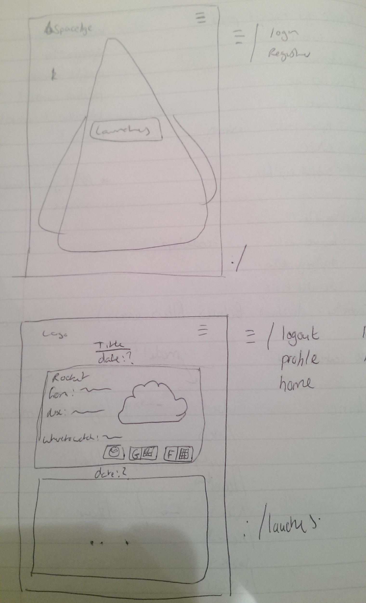
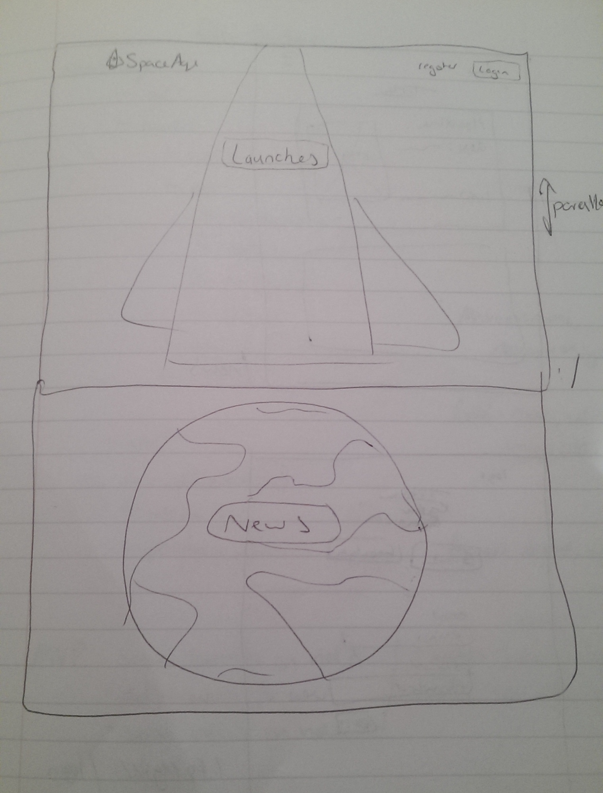
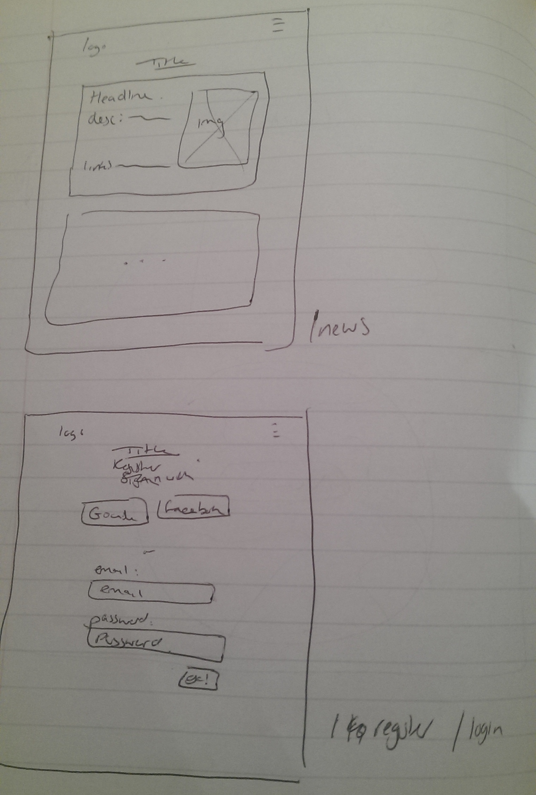
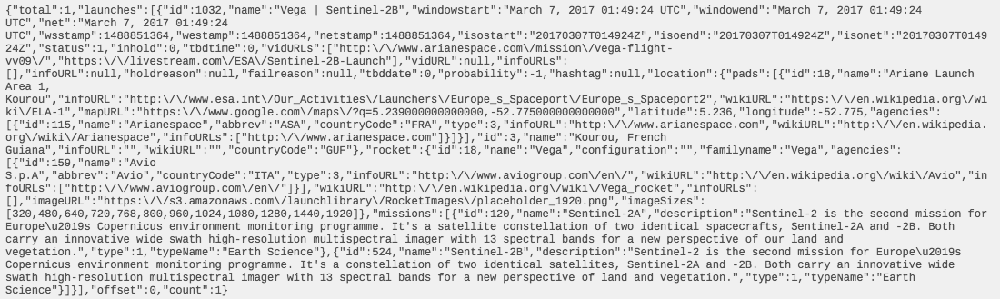

# Space Age by Christopher Tsoi

## About

Web App that interacts with lauchlibrary.net's API amongst others to display upcoming rocket launches
Space Age is a Node/Angular Web App that interacts with a variety of APIs including:
* lauchlibrary.net
* openweathermap.org
* guardian.co.uk
* googlemaps

The purpose of the application is to display to users upcoming rocket launches as well as return news relating to the overall subject of rockets.

The app was developed created as an individual project during my training as a Web Developer at Sparta Global.

#### The site is currently deployed on heroku: @ https://spaceage-one.herokuapp.com/#!/

It encompasses both a frontend angular application and backend node API. Some requirements include:
* Node, express and mongo/mongoose for database
* Single page app
* API structure
* Make use of google firebase for authorisation
* rMVC design pattern
* At least one external API
* Use angular and a large part of its functionality
* Ui-router for states
* Git tracked
* Professional

## Installation
A number of steps are required if you would like to try to run this on your own machine.

Requires a version of node to be installed

1. Download the github project to a folder of your choice
2. At the command line: npm install to retrieve the required packages
3. Apply and recieve API keys for openweathermap.org, googlemaps and guardian.co.uk
4. Run command nodemon within the src folder
5. You should now have your own instance running on localhost:3000

## Credits
I would like to give my thanks to the rest of the team here at Sparta Global including my teammates, Niall Wallace, Ollie Holden and Stephen Reid

## Creation
### Theme
The content of the site came about from my love of things relating to rockets et al.

### Design
#### MVP
Before coding began the project was scoped out to align the MVP (Minimum Viable Product). These included:
* Displays upcoming rocket launches
* Displays a single rocket launch in more detail
* Ability to mark them in some way for future reference (Favoriting and/or add to calender)
* Display of space/rocket news

#### User Control Flow
The user control flow was then outlined:

|        |                    |                       |
| ------ |:------------------:| ---------------------:|
| Home / | Users /users       | /, /new, /edit, /show |
|        | Launches /launches | /, /show              |
|        | News /news         | /, /show              |

This gave a good idea of the sort of states that the single page application would have

#### Wireframes
For each of these states, condensed where possible, a quick wireframe sketch was drawn out.

##### Home(Mobile) and Launches Index

##### Home

##### News and Register/Login

#### Models
The data that would be present in the database would then be modelled. This resulted in a sketch for a schema for a launch and one for a user.

The fields within the model were determined by researching the APIs the project was going to use and through the postman APP sending real data to them and reading what was returned.

Launch for example produced a large object that required dissecting to understand what data was needed.

##### Example Launch Object

#### Architecture
The final step before the start of coding was the outlining of the basic tasks needed to be fulfilled and the architecture that would be created from it.

### Coding
The coding of the project was mostly a iterative process doing each small task or function one after the other. However, this was occasionally bypassed when some guidance was needed and other tasks were worked on in the meantime.

The process also involved automated testing of the backend API through mocha/chai, though unfortunately this was not continued to the end.

### Final Result
The end product meets the outlined MVP, though the thrid point of '* Ability to mark them in some way for future reference (Favoriting and/or add to calender)' could do with more fleshing out.

It also meets all the set out requirements in the project brief. Though testing could be further improved.

## Conclusions
The current state of the product is something I'm reasonably happy with. There is some functionality that still needs to be implemented (aka add to calender), and plenty of extra touches I would like to add.
